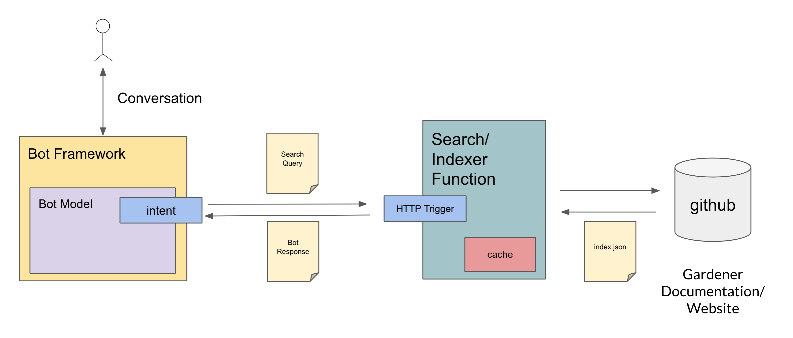

# gardener-docs-search

This project allows to search the Gardener documentation and integrate it into a bot framework. The overall flow looks like the following



## Deploying Cloud Function

The search backend can be deployed to GCP as a Cloud Function via

```bash
gcloud functions deploy gardener-search --entry-point Search --runtime go111 --trigger-http --memory 128
```